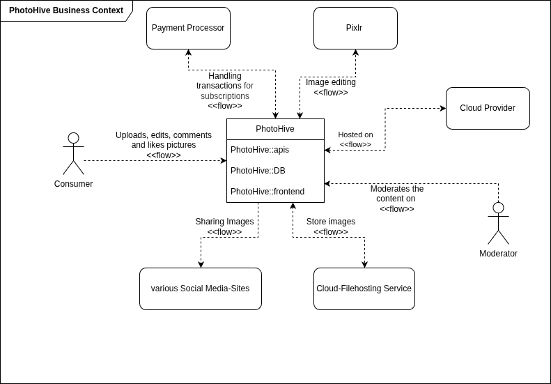
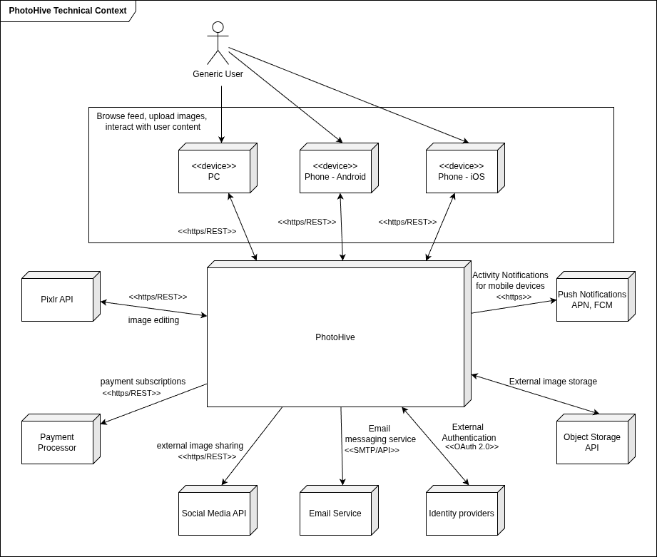

ifndef::imagesdir[:imagesdir: ../images]

[[section-context-and-scope]]
== Context and Scope

=== Business Context

[cols="1,2"]
|===
|Element |Description

|Payment Processor
|Company handling all payment transactions with our customers, e.g. Stripe, Adyen

|Pixlr
|Application which provides PhotoHive with image editing functionality

|Cloud Provider
|Service which hosts PhotoHive Kubernetes Cluster, e.g. AWS, MS Azure, GCP

|Cloud Filehosting
|Service that stores all uploaded images, e.g AWS S3

|Social Media Sites
|Interface to publish uploaded images directly to popular social media platforms, e.g. Instagram, Facebook, X

|===

<<<
=== Technical Context

