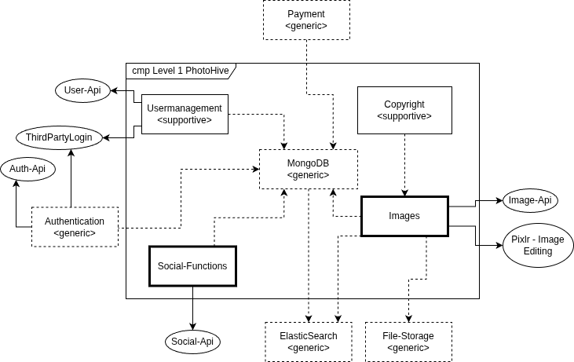
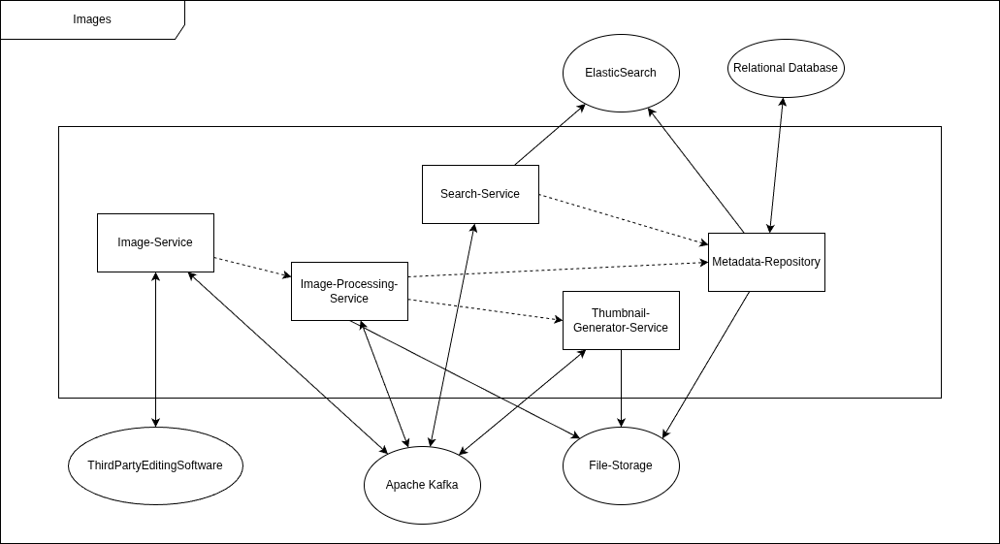
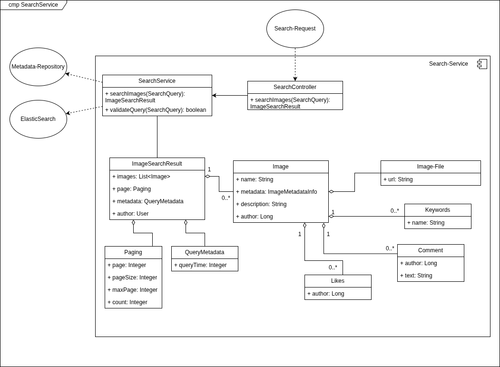

ifndef::imagesdir[:imagesdir: ../images]

[[section-building-block-view]]

== Building Block View

=== Level 1 PhotoHive

Motivation:: 

We used functional decomposition to separate responsibilities of the various services and connected them via Kafka to enjoy the various benefits of a microservices architecture.

The building blocks in this image do not include all services and are only rough groupings of several services. 

Contained Building Blocks::
[options="header",cols="1,4"]
|===
|Building block|Description
| <<BB_1_Images>> | Image searching, viewing, uploading and editing via third-party-apis. 
| BB_2_Social-Functions | Liking, Commenting and various other social functions.
| BB_3_Usermanagement | Provides various features related to the management of accounts.
Also includes tools related to the administration of the users.
| BB_4_Copyright | Includes various tools to check for and verify potential copyright issues. 
Also includes workflows for dealing with copyright issues.
|===
Important Interfaces::
[options="header",cols="1,4"]
|===
|Interface|Description
| Authentication | Used to handle multiple login-methods like thrid-party-login and 2FA. 
| Payment | Handles the payments for subscriptions.
| PIXLR | Provides various features to edit images.
|===

=== Level 2

[#BB_1_Images]
==== BB_1 Images

The dotted lines show the general request flows, because the majority of the communication is handled via Apache Kafka as a message broker.

Motivation:: 

The internal structure of Images follows a functional decomposition: 
- overall image handling
- metadata generation
- thumbnail generation
- metadata handling
- search

Contained Building Blocks::
[options="header",cols="1,4"]
|===
|Building block|Description
| Image-Service | This is the main-service for various image-related functions, which further delegates a lot of it's tasks to other services. 
| Image-Processing-Service | Handles the processing of the uploaded images. It manages the file-upload, metadata generation and further also the thumbnail generation.
| Thumbnail-Generator-Service | Handles the generation of thumbnails in various formats and sizes.
| Metadata-Repository | Is the main class responsible for the management of the image-properties. 
| Search-Service | Search-Requests are handled via this service by checking against ElasticSearch and the metadata. 
|===

=== Level 3

==== BB_1.1 Search-Service

Motivation:: 

The internal structure of Images follows a layered decomposition: 
- handling incoming requests (_SearchController_)
- doing the search (_SearchService_)
- the results of a search (_ImageSearchResult_, etc.)

Contained Building Blocks::
[options="header",cols="1,4"]
|===
|Building block|Description
| SearchController | Controller which handles incoming requests.
| SearchService | Service which handles the collection of the required data.
| ImageSearchResult | Aggregated result of the search including search-metadata and paging.
| Paging | Describing which results where found and how many are available.
| QueryMetadata | Contains metadata regarding the search itself.
| Image | One of the images which was found with it's metadata.
| Image-File | Link to the file of the image itself.
| Keywords | Keywords which could be searched to find a specific image.
| Comment | Comments which where added to this image.
| Like | Likes which where added to this image.
|===