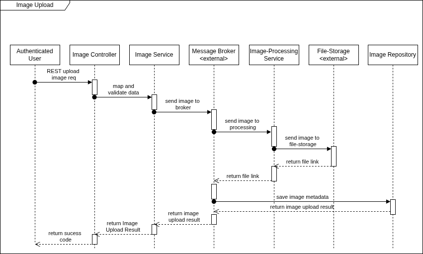

ifndef::imagesdir[:imagesdir: ../images]

[[section-runtime-view]]
== Runtime View

=== RV_1 Image Upload

. Authenticated user calls **upload** endpoint
. **Image controller** maps / validates request and image data
. **Image service** splits image from metadata and sends them to **message broker**
. **Image-Processing** service recceives image and tries to send it to **object storage**
. If successful receives **link to stored image** and sends it to **message broker**
. **Image repository** now has required data and **stores metadata and file link** in database
. Transaction was successful and user receives a success message

* In case of object storage being unavailable the system tries to retry action with exponential backoff. If retries are exhausted user is informed of the failed transaction.

=== RV_2 Image Search 

. Authenticated user calls **search** enpoint
. **Image controller** maps validates request parameters and forwards it to **Image Service**  
. Search request is sent to **Search Service** via **message broker**
. **Elastic Search** service executes search and returns results to **Search Service** 
. **Image Service** receives results and retrieves image metadata from **Image Repository**
. Results get returned to user

* In case of elastic search being unavailable the system will use exponantial backoff to retry the action. The user is informed of the failed action if retries are exhausted