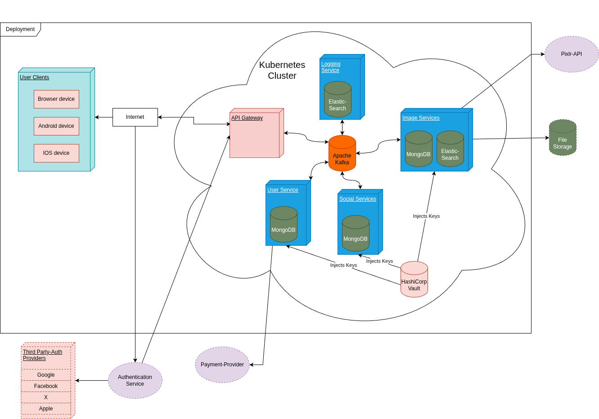

ifndef::imagesdir[:imagesdir: ../images]

[[section-deployment-view]]

== Deployment View

This diagram shows how PhotoHive is deployed as a microservice-based application.

Motivation::

Most of the deployed services are deployed in a Kubernetes cluster to enable strong availability and scalability.
The services inside the cloud are deployed on multiple nodes accross the world to improve performance world wide.
Communication between the services is generally handled via Apache Kafka as a message broker to further improve the availabilty.

<<<
Mapping of Building Blocks to Infrastructure::

[options="header",cols="1,4"]
|===
|Building block|Infrastructure
| Cluster Nodes: +
 <<BB_1_Images>> +
 BB_2_Social-Functions +
 BB_3_Usermanagement +
 BB_4_Copyright  | Are deployed as Pods inside the cluster to enable scaling.
| API Gateway | Are also deployed as Pods inside the cluster to enable scaling. They handle the communication between the clients and the internal Cluster Nodes.
These nodes are the only ones which are reachable directly by the clients via the internet. 
| HashiCorp Vault | Is used to inject various secrets into the containers, where they are needed.
| Apache Kafka | Deployed with strong redundancy in the cloud to serve as the backbone of the communication inside the Application.
| Android device & IOS device | For these mobile devices the deployment is handled via their respective App-Stores: Google Play and App Store.
| Browser device | These are served by static web site deployments from the cloud.
|===
