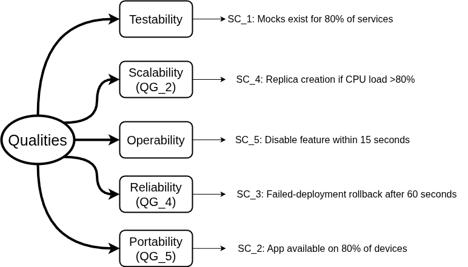

ifndef::imagesdir[:imagesdir: ../images]

[[section-quality-scenarios]]
== Quality Requirements

=== Quality Tree

_Note: The (QG_X) in the following table correspond to top level quality requirements from_ <<Quality Goals>>.

=== Quality Scenarios

==== SC_1: Mocks exist for 80% of services

.*Context*

Mocks are fake objects which can be used during development to "mock" services.
They are also used a lot for unit and integration testing.

.*Trigger*

A tester needs to mock a service for a new integration test.

.*Acceptance Criteria*

- For 80% of the services mocks should be available.

==== SC_2: App available on 80% of devices

.*Context*

The application should be available worldwide and be installable on a variety of devices.

.*Trigger*

A user installs or opens the application/website.

.*Acceptance Criteria*

- The app can be installed and runs on at least 80% of the active global device market share.

==== SC_3: Failed-deployment rollback after 60 seconds

.*Context*

When errors occur because of a deployment, the impact should be kept to a minimum to prevent big cascading issues.

.*Trigger*

The deployment of a new version fails.

.*Acceptance Criteria*

- The deployment is automatically aborted and a rollback is triggered, restoring the service to the previous known good state.
- The last stable version is restored within 60 seconds of the failure detection.

==== SC_4: Replica creation if CPU load >80%

.*Context*

The application uses Kubernetes for a scaling architecture. In case of high load, more services should be automatically created to handle the load and prevent performance degradation.

.*Trigger*

The CPU load of a service exceeds specified threshold. 

.*Acceptance Criteria*

- Automatically provision additional replicas if the CPU load exceeds 80%.
- Replicas are provisioned and begin accepting traffic within 60 seconds.

==== SC_5: Disable feature within 15 seconds

.*Context*

New features are added quiet often, which sometimes cause issues.
These features should then be easily disableable. 

.*Trigger*

A system administrator decides to disable a certain feature, because it is causing issues.

.*Acceptance Criteria*

- The feature should be completely disabled if the corresponding feature flag is flipped to "disabled".
- This feature flag change should be propagated to all active user sessions within 15 seconds.
